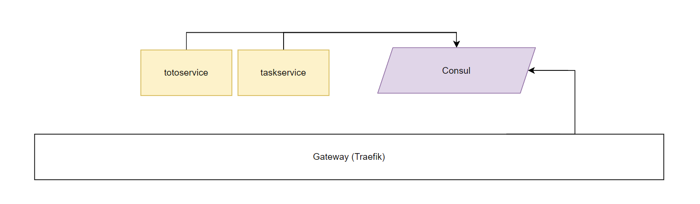

# 🦠 microservices-consul-traefik

In this project, we have microservices that register with Consul. Each services, announce themselves to Consul with some information like health check, name, port and tags. The Gateway used is Traefik. Traefik will fetch services from Consul catalog and thanks to tags generate routes.

- [🦠 microservices-consul-traefik](#---microservices-consul-traefik)
  - [Arch](#arch)
  - [📒 Service registration](#---service-registration)
  - [⛕ Traefik](#--traefik)
  - [🚀 Run it](#---run-it)
    - [Consul](#consul)
    - [Traefik](#traefik)

## Arch



We have 2 services written in python.

```python
import consulate
from flask import Flask

app = Flask('app')

@app.route('/toto')
def root():
    return '<h1>Hello, Server! tasks Service</h1>'

@app.route('/')
def run():
    return 'ok'

tags = [
    'traefik.enable=true',
    'traefik.http.routers.approuter.rule=PathPrefix(`/task`)',
    'traefik.http.routers.approuter.entrypoints=web',
    'traefik.http.routers.approuter.service=task-service',
    'traefik.http.services.task-service.loadbalancer.server.port=8000',
    'traefik.http.services.task-service.loadbalancer.server.scheme=http'
]

consul = consulate.Consul()
print(consul.catalog.services())
consul.agent.service.register('task-service', port=8000, tags=tags, interval='2s', httpcheck='http://host.docker.internal:8000')

if __name__ == "__main__":
    app.run(host='0.0.0.0', port=8000)
```

Each service is a small web app, it use Flask.

## 📒 Service registration

```python
consul.agent.service.register(
	'task-service',
	port=8000,
	tags=tags,
	interval='2s',
	httpcheck='http://host.docker.internal:8000'
)

```

## ⛕ Traefik

```python
tags = [
    'traefik.enable=true',
    'traefik.http.routers.approuter.rule=PathPrefix(`/task`)',
    'traefik.http.routers.approuter.entrypoints=web',
    'traefik.http.routers.approuter.service=task-service',
    'traefik.http.services.task-service.loadbalancer.server.port=8000',
    'traefik.http.services.task-service.loadbalancer.server.scheme=http'
]
```

Tags will be grabbed by Traefik and it will generate this configuration :


At the end we have this configuration :


## 🚀 Run it

You need Docker to run Consul, Traefik can be installed depending of your preferences.

### Consul

```python
docker run -p 8500:8500 -p 8600:8600/udp --name=consul consul agent -server -bootstrap -ui -client="0.0.0.0"
```

[http://127.0.0.1:8500/ui/](http://127.0.0.1:8500/ui/)


### Traefik

[https://doc.traefik.io/traefik/getting-started/install-traefik/](https://doc.traefik.io/traefik/getting-started/install-traefik/)

```bash
docker run -d -p 8080:8080 -p 80:80 \
    -v $PWD/traefik.yml:/etc/traefik/traefik.yml traefik:v2.9
```

MacOs

```bash
brew install traefik
```


